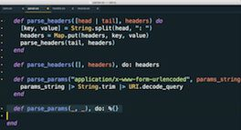

# Elixir & OTP #
## Learning a functional language may seem daunting, but what if it was delightful instead? ##
**Elixir is a fantastic functional language that's practical, enjoyable, and easy on the eyes.** 🤩

But it's more than just syntax sparkle and cool language features.

**What sets Elixir apart is that it runs on the BEAM (the Erlang VM).**

And the BEAM totally rocks.

It was designed specifically for creating scalable, fault-tolerant systems. Spinning up a million supervised processes is just table stakes for the BEAM. After decades of production use, it's still the undisputed king of reliability. 👑

**And then there's OTP.**

It's a set of battle-tested abstractions for building highly concurrent, distributed applications. GenServers and Supervisors are the two main workhorses. The OTP libraries give you a huge amount of leverage.

Elixir + OTP + BEAM = 💜

**Indeed, Elixir is uniquely positioned for building today's demanding systems.**

It's a versatile language with many real-world uses:

✅ real-time, interactive web applications with Phoenix 
✅ machine learning and concurrent data processing systems 
✅ high-volume request and messaging apps 
✅ and even fleets of IoT devices managed by Nerves

Aside from that, adding Elixir to your repertoire will make you a more well-rounded (and employable!) developer. 🤓

Sounds pretty great, right?

**And it's tempting to jump straight into Elixir and hope for the best.**

But that's like being airdropped into a foreign city without a map or translator.

Haphazardly trying to "feel" your way around a new language is disorienting and frustrating. You don't know where things are or how things are connected. So you bounce from one topic to the next hoping to fill everything in. But you just end up with <ins>knowledge gaps that become pitfalls</ins> when you try to build something real with Elixir.

At the worst, you simply give up.

At the best, you copy-paste code without knowing how or why it works. 🥲

**Imagine writing Elixir as effortlessly as any other language in your toolkit.**

Everything would finally click:

⭐️ You'd know all the idioms and best practices. 
⭐️ You'd confidently design code in the spirit of Elixir. 
⭐️ You'd wield all the power of OTP. 
⭐️ Writing Elixir would be fun, not frustrating.

**This comprehensive course has everything you need, in the right order, and in one place!** 👍

No need to scour the web and waste your time piecing together resources. We distilled everything you need to know about Elixir and OTP into an approachable and —dare we say— pragmatic video course.

Our course has worked for <ins>thousands of developers</ins> because it builds an application step by step in a clear, logical progression.

It starts with Elixir fundamentals and gently builds up to the OTP abstractions so you know when and why to use them. And yeah, there are a few bad puns along the way, but we do try to make it fun. 🤪
 
## 36 Videos • 6 Hours ##
We build an app feature-by-feature in the videos so you **see and understand exactly how it's done**. Each live-coding video is:

- tightly-edited to respect your time
- straight to the point without any rambling or fumbling
- perfectly paced so you're not left behind or nodding off
- streamable with English subtitles and also downloadable

 

## Animations ##
Seeing code is hardly enough. You also gotta see the big picture. Each of the **22 visual explanations** throughout the course give you:

- a solid mental model for how everything fits together
- a visual explanation that takes the mystery and magic out of OTP
- the key to becoming the magician rather than the mystified

 

## Source Code ##
Of course you get all the source code for the final app, and also versions of the app for each course module. Yup, that includes the tests, too!

## Exercises & Notes ##
You need deliberate and directed practice to make all this "stick". That's why you also get a workbook with **56 guided exercises** and supplemental notes. Each hands-on exercise:

- immediately reinforces what you learned in the video
- includes the solution, of course
- spotlights handy tips and tricks

 

# Course Outline #
Videos just the way you like 'em: easy to digest, straight to the point, and paced for experienced developers.

## 01. Intro and Setup ##
Welcome! After taking a peek at the type of app we're going to build in this course, we'll help you get your **development environment set up** so you can start coding Elixir.

## 02. Create a Mix Project ##
Elixir has conventions for organizing projects and great tooling to automate project tasks using **mix**. We'll get a quick lay of the land, learn various ways to **run Elixir**, and jump right into code!

## 03. High-Level Transformations ##
Our web server will make three high-level transformations—parsing, routing, and formatting a response—with each step being a function. We'll set up an initial pipeline using **modules, named functions, strings, maps, and the pipe operator**.

## 04. Pattern Matching ##
To transform a request into a response, we first need to parse the request string into a more usable data structure. This presents a great opportunity to learn the **match operator, pattern matching techniques, atoms, and built-in functions**.

## 05. Immutable Data ##
Formatting the response string takes us deeper into Elixir maps and introduces us to **programming with immutable data**, which is a hallmark of functional programming.

## 06. Function Clauses ##
In Elixir you don't use conditional expressions as often as you would in imperative languages such as Ruby. Instead, it's more idiomatic to control the flow of a program using **function clauses and pattern matching**. Routing HTTP requests gives us an ideal context for learning how to design code in this declarative style.



## 07. Advanced Pattern Matching ##
Designing a web server presents interesting scenarios that let us explore many of Elixir's features. How do we handle a request that has parameters? What happens if a route doesn't match? And how should we respond? The solutions require more **pattern matching techniques and multi-clause functions**.


## 08. Pattern Matching Maps ##
Once we have requests flowing through a pipeline, we can plug in specialized functions that transform requests and responses in unique ways such as rewriting paths and tracking 404s. By **pattern matching maps** we can run these functions conditionally—a powerful techniques that's used extensively in Elixir applications.

## 09. Serving Files ##
Even something as familiar and straightforward as reading a file involves pattern matching. Serving static files, and properly handling successes and failures, introduces us to **tuples and case expressions**.

## 10. Module Attributes ##
Sometimes you need to attach metadata to a module, be it for documentation or to squirrel away a compile-time constant. In this section we use **reserved and custom module attributes**.

## 11. Organizing Code ##
Modules let us organize functions with similar concerns in a namespace. We'll co-locate related functions in properly named modules, put them in separate files, and knit it all back together using **aliases and imports**.



## 12. Modeling with Structs ##
One of the benefits of modeling our request/response conversation as a **struct** (as compared to a generic map) is we can ensure that the functions in our pipeline always get the expected type. In this section we compare **structs vs. maps** and refactor our design to use a struct.



## 13. Matching Heads and Tails ##
Handling a POST request means we have to take into account the list of request headers and the POSTed parameters. To do this, we'll process the request by matching **head and tail patterns**: a technique used pervasively in Elixir apps.

## 14. Recursion ##
Recursion makes Elixir go 'round and 'round. You've no doubt seen simple examples of recursion, but what about real-world use cases? Turns out, **recursion** is exactly what we need to parse the HTTP headers in our POST requests. And while Elixir has convenience functions that often let you sidestep using recursion directly, Elixir pros know how to use recursion to their advantage.



## 15. Slicing and Dicing with Enum ##
You'll find familiar **high-order functions** in the Enum module for transforming data. But to use them effectively you need to be comfortable with **anonymous functions** and how to **capture functions**. We also put **guard clauses** to good use as our application begins to take the shape of a familiar web framework.



## 16. Comprehensions ##
Now it's time to **generate dynamic content** by reading and evaluating template files. We make quick work of this using **comprehensions** to iterate through collections of data and generate HTML.


## 17. A Peek At Phoenix ##
Since Elixir is the language you use to build **Phoenix web apps**, a peek at a Phoenix app reveals a lot of familiar syntax and design concepts. Alas, you discover there really is no magic after all!


## 18. Test Automation #
It's time to automate with **ExUnit** tests! We look at two different ways to write unit tests, and various ways to run them. By the end we have green dots across the board.



## 19. Rendering JSON ##
To build a JSON API, we install an **external JSON library** and use it to render JSON and handle POSTed JSON data in response to API requests.


## 20. Web Server Sockets ##
Now that we have a fully-functioning HTTP request handler, it's time to write a **TCP socket server** so that any HTTP client can interface with our application. To do that, we use **Erlang's gen_tcp library** and learn how to **transcode Erlang to Elixir**. Cue the browser!


## 21. Concurrent, Isolated Processes ##
At this point our web server can only handle one request at a time. We need a way to **handle multiple requests concurrently** and also isolate the failure of one request so it doesn't affect other requests. **Concurrent, isolated processes are what set Elixir apart from other functional languages!** We also look inside the Erlang VM to see how it takes full advantage of multicore computers to achieve remarkable levels of concurrency and parallelism.



## 22. Sending and Receiving Messages ##
So if processes are isolated and run concurrently, how do they communicate? Just like people! They send asynchronous messages to each other. In our app, we **spawn a series of API requests** that run in independent processes. They send back their results as **messages** to be received by the request-handling process. We also look at how to avoid unwanted **synchronization points** in our code.


## 23. Asynchronous Tasks ##
With several one-off asynchronous tasks now running and getting results at a later time, we're starting to see a definite pattern. In fact, **running functions (or tasks) in a short-lived process** is so common that Elixir provides a helpful abstraction: the Task module. By the end you'll know how the Task module works under the hood.

## 24. Stateful Server Processes ##
Now we turn our attention to **long-running server processes that manage internal state** and respond to various messages. We build up from a basic **receive loop** to a **client API** that sends synchronous and asynchronous requests to a **registered server process**. Along the way, we see how a server process preserves the integrity of its state while under load from multiple concurrent client processes. By writing a server process from scratch, we begin to demystify the "magic" of a GenServer.

## 25. Refactoring Toward GenServer ##
Looking at our stateful server process, we see two flavors of code: code that's common to all server processes and application-specific code. So what happens when we move all the common code into a generic module? Well, we're not the first ones to have that idea! GenServer is a design pattern (an OTP behavior) that helps us write server processes with greater ease. **By refactoring our server process, you'll come away with a better understanding of how (and why!) GenServer works**.

## 26. OTP GenServer ##
When you're starting out with Elixir, writing a GenServer can be confusing and it's tempting to just cargo cult from example code. But we want you to feel really confident, so we've been incrementally building up to using a GenServer. Spoiler alert: **Now that you understand the underlying design pattern and how it's implemented, actually using a GenServer is a snap!** Besides converting our app to use a GenServer (and eliminating a bunch of code!) we also **add new application-specific behavior** to our GenServer.



## 27. Another GenServer ##
As another practical example of when and how you'd use a GenServer in a real application, we write a server process that **performs background work on a periodic interval**. This lets us explore the power of the **handle_info** callback in greater depth so you can take full advantage of all that GenServer has to offer.


## 28. Linking Processes ##
At this point we have three server processes that should run continuously without missing a beat. Alas, things don't always go according to plan! We need a way to monitor the server processes and recover when trouble strikes. To do that, we start by **linking processes, which is fundamental to understanding how the OTP Supervisor behavior works**.



## 29. Fault Recovery with OTP Supervisors ##
Normally, designing an application that's resilient to failures is a tall order. With other languages, the best you can do is to code defensively. Elixir is different: it frees you to "let it crash." That's only possible because OTP Supervisors offer unparalleled support for detecting and recovering from process failures. Indeed, Supervisors are the key to building high-availability, fault-tolerant systems. We **design a supervision tree so our application can elegantly recover from unforeseen failures**.



## 30. Final OTP Application ##
Up to this point we've been using the term "application" fairly loosely. But an Elixir application is a first-class OTP entity. We look at **how an application works behind the scenes, and then specialize the OTP Application behavior to start our supervision tree**.



# For Developers New to Elixir #
#### No functional programming experience required. ####

To keep this course focused and paced just right, we assume you've programmed in another language.

With that background, you definitely don't need a whole video on Elixir numbers and strings. Reference courses like that are booooring. But you also don't want to jump right into asynchronous messaging between two supervised GenServers. Whoa, that's totally frustrating too.

When a course makes the wrong assumption about your experience and the pacing is flawed, you're left hung out to dry.

This course aims for the sweet spot by:

✅ taking a practical project-based approach, not a sluggish syntax-approach 
✅ deconstructing the underlining principles before introducing abstractions 
✅ assuming you have programming experience, just not with functional programming or Elixir
